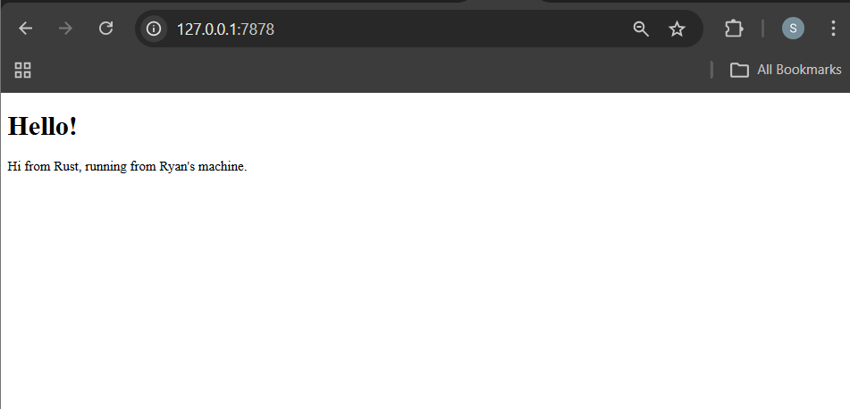
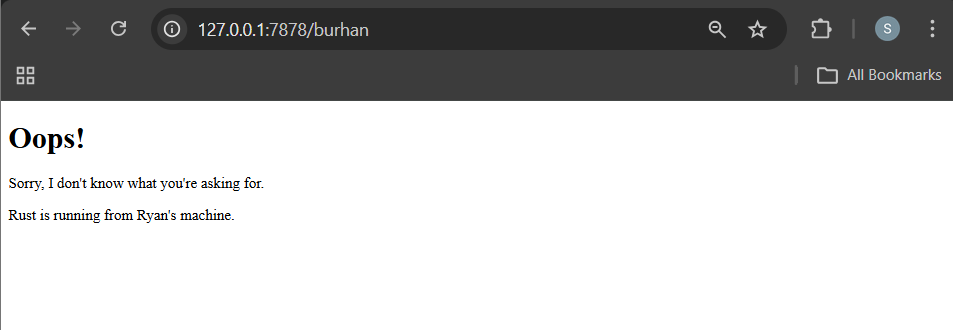

# Tutorial 6 - Web Server

**Nama:** Ryan Gibran Purwacakra Sihaloho
**NPM:** 2406419833

---

## Commit 1 Reflection notes

Pada *commit* ini, saya menambahkan fungsi `handle_connection` untuk membaca dan memproses *request* TCP yang masuk dari *browser*. 
Fungsi ini menggunakan `BufReader` yang membungkus `TcpStream` agar pembacaan aliran data dari klien menjadi lebih efisien. 
Data *request* HTTP tersebut kemudian dibaca baris per baris menggunakan metode `.lines()`. 
Program akan terus membaca teks tersebut dan mengumpulkannya ke dalam sebuah struktur data *vector* bernama `http_request` melalui metode `.collect()`. 
Proses pembacaan ini diinstruksikan untuk berhenti secara otomatis ketika menemukan baris kosong, yang ditangani oleh metode `.take_while(|line| !line.is_empty())`. 
Terakhir, program mencetak keseluruhan isi *request* tersebut ke terminal sehingga saya dapat menganalisis detail informasi yang dikirimkan oleh klien, seperti tipe metode HTTP (GET), *host* tujuan, dan data *user-agent*.

## Commit 2 Reflection notes

Pada tahapan ini, saya memodifikasi fungsi `handle_connection` agar server tidak hanya membaca *request*, tetapi juga memberikan *response* yang valid berupa halaman HTML. 
Saya menambahkan modul `fs` (File System) dari standard library Rust untuk membaca isi file `hello.html` ke dalam bentuk *string*. 
Setelah file terbaca, saya menyusun HTTP *response* yang terdiri dari *status line* (`HTTP/1.1 200 OK`), *header* `Content-Length` (menandakan ukuran konten), dan diakhiri dengan isi (body) HTML tersebut yang dipisahkan oleh karakter baris baru ganda (`\r\n\r\n`). 
Terakhir, `stream.write_all()` digunakan untuk mengirimkan sekumpulan *byte* dari variabel *response* kembali ke klien melalui koneksi TCP. Perubahan ini membuat web server kini dapat menampilkan antarmuka web sederhana secara langsung di browser.

## Commit 3 Reflection notes

Pada milestone ini, saya menambahkan validasi untuk mengecek isi dari HTTP request. 
Program kini mengekstrak baris pertama dari request (`request_line`). 
Jika request tersebut meminta path root (`GET / HTTP/1.1`), server akan mengembalikan file `hello.html` dengan status 200 OK. Namun, jika path yang diminta berbeda, server akan masuk ke blok `else` dan mengembalikan halaman error `404.html` dengan status 404 NOT FOUND.

Selain itu, saya juga melakukan *refactoring* pada kode di dalam `handle_connection`. Awalnya, kode untuk membaca file dan merakit respons HTTP ditulis berulang kali di dalam blok `if` dan `else`. Hal ini melanggar prinsip DRY (*Don't Repeat Yourself*). 
Oleh karena itu, saya melakukan *refactoring* dengan cara mengisolasi bagian yang benar-benar berbeda saja (yaitu `status_line` dan `filename`) ke dalam sebuah ekspresi `if-else` yang me-return *tuple*. Setelah penentuan *tuple* tersebut selesai, barulah proses pembacaan file dan penulisan respons ke *stream* dilakukan di bagian paling bawah. 
Pemisahan (*split*) struktur ini membuat kode jauh lebih ringkas, bersih, dan mempermudah penambahan halaman baru di masa depan karena logika pengiriman respons terpusat di satu tempat.